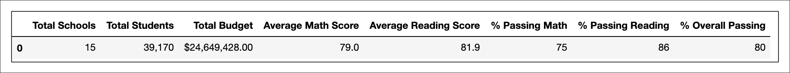
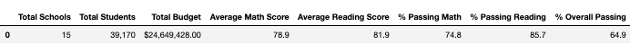
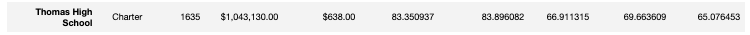
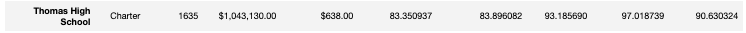
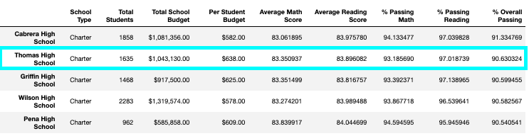
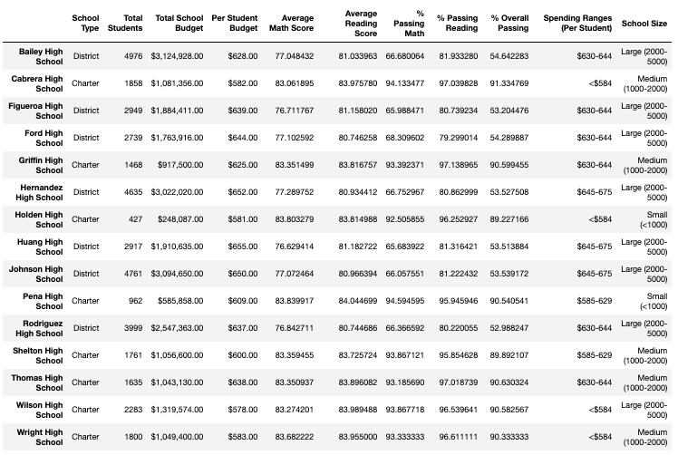
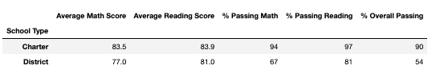

# District Analysis

## Overview

The purpose of this analysis was to clean data to create an accurate report of standardize testing in a City’s school district. Upon initial observation, we found there were likely mistakes entered for some student’s names. Looking into it further, we suspected data for the math and reading grades of Thomas High Schools 9th grade class. This python code cleans up the student’s names, removes the possibly alerted data, and creates reports on the resulting data.  

## Results 

* Overall the averages for passing math and reading scores went down for the district after cleaning the data

*District Summary Before*

*District Summary After*

* Thomas High School passing math and reading averages improved 

*Thomas High School Before Before* 

*Thomas High School After*

* After test score data of Thomas High Schools 9th grade class, there test scores ranked in the top 5 school in the district

*Top 5 Schools in the District* 

* Removing the test results for Thomas High School’s 9th grade affects the 9th grade metrics in the following ways: 

	* Breaking the match and reading scores down by grade is necessary to show that we are missing data. We should be honest about not having data on the 9th grade class of Thomas High School or it may appear as though we are trying to skew data.   

	* The results for Thomas High School, post adjustment,  is comparable to  to Griffin High School,  Wilson High School, and Wright High School in terms of The % Overall Passing and Total Spending Budget

	* The results for Thomas High School, post adjustment,  is comparable to Griffin High School,  Wilson High School, and Wright High School in terms of The % Overall Passing and Size

  *Scores by School Including Spending and Size*
  
  

  * Because there are significantly more district school students, removing the 9th Grade from Thomas High School likely has very little effect
   
   *Scores by School Type*
   
   

## Summary 

After replacing the test scores for the 9th grade class at Thomas High School we see a positive change for Thomas High School and a negative change overall. The decision to delete an entire grade from a school should be carefully considered. If we use the metrics included outline in this document, we must disclose that select data has been removed. 

 
